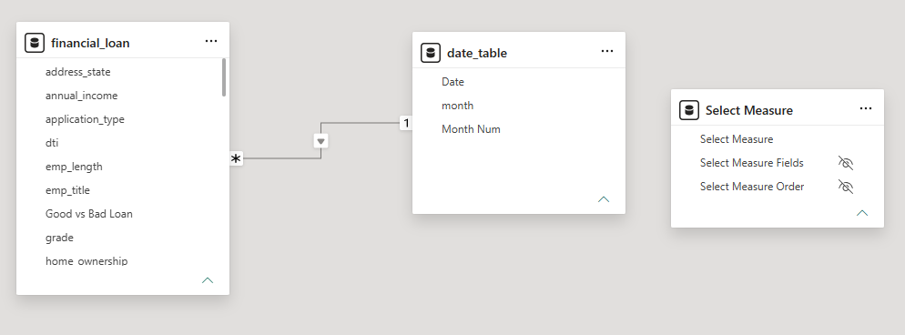

# Bank Loan Performance & Risk Analysis Dashboard

> **Transforming raw financial lending data into actionable risk management insights through SQL analysis and interactive Power BI visualizations.**

---

## 📌 Overview
This project provides an end-to-end analytics solution for bank lending data. By processing raw financial records through SQL and modeling them in Power BI, this repository demonstrates how to track key performance indicators (KPIs), evaluate portfolio health, monitor loan profitability, and assess risk distributions.

---

## 🎯 The Challenge
Financial institutions require clear visibility into their lending portfolios to mitigate default risk and optimize capital deployment. The goal of this analysis was to aggregate high-volume loan application trends, monitor funded amounts, and evaluate borrower creditworthiness to support data-driven lending and risk strategy decisions.

---

## 💡 The Solution
A robust analytical pipeline was built using SQL for data extraction, aggregation, and business logic implementation, followed by Power BI for dynamic modeling and visualization.

### Key Insights & Metrics Extracted
* **Overall Portfolio Health:** Analyzed 38,576 total loan applications representing over **$435 million** in total funded capital.
* **Risk Classification:** Categorized portfolio performance into **Good Loans (86.18%)** vs. **Bad Loans (13.82%)**, measuring total cash received against principal funded for each tier.
* **Borrower Profiles:** Evaluated portfolio health across a **12.05% average interest rate** and a **13.33% average Debt-to-Income (DTI)** ratio.
* **Dynamic Segmentation:** Granularly sliced performance across Month-to-Date (MTD), State, Loan Term, Employment Duration, Loan Purpose, and Homeownership status.

---

## 🛠️ Tools & Technologies Used
* **SQL:** Data querying, CTEs, window functions, and KPI calculation logic (MTD, Previous Month MTD).
* **Power BI:** Star schema data modeling (`bank_loan_dashboard.pbix`), DAX measures, interactive filtering, and dynamic visualization.
* **Excel / CSV:** Source data validation and preliminary analysis.

---

## 📊 Dashboard Preview


*Figure 1: High-Level Portfolio Performance & Summary View.*

<br>


*Figure 2: Monthly Trends & Key Metric Overview.*

<br>


*Figure 3: Granular Borrower & Loan Details Breakdown.*

---

## 🛢️ SQL Queries & Business Logic

The core metrics and calculations displayed in the dashboard were structured and validated using SQL Server (T-SQL) queries.

### 1. Key Performance Indicators (KPIs)
```sql
-- Total Applications, MTD, and PMTD
SELECT COUNT(id) AS Total_Applications FROM bank_loan_data;
SELECT COUNT(id) AS MTD_Applications FROM bank_loan_data WHERE MONTH(issue_date) = 12;
SELECT COUNT(id) AS PMTD_Applications FROM bank_loan_data WHERE MONTH(issue_date) = 11;

-- Portfolio Funding & Amount Received
SELECT SUM(loan_amount) AS Total_Funded_Amount FROM bank_loan_data;
SELECT SUM(total_payment) AS Total_Amount_Collected FROM bank_loan_data;-- Good Loan Metrics (Fully Paid & Current)
SELECT
    (COUNT(CASE WHEN loan_status IN ('Fully Paid', 'Current') THEN id END) * 100.0) / COUNT(id) AS Good_Loan_Pct,
    COUNT(id) AS Good_Loan_Applications,
    SUM(loan_amount) AS Good_Loan_Funded_Amount,
    SUM(total_payment) AS Good_Loan_Amount_Received
FROM bank_loan_data;

-- Bad Loan Metrics (Charged Off)
SELECT
    (COUNT(CASE WHEN loan_status = 'Charged Off' THEN id END) * 100.0) / COUNT(id) AS Bad_Loan_Pct,
    COUNT(id) AS Bad_Loan_Applications,
    SUM(loan_amount) AS Bad_Loan_Funded_Amount,
    SUM(total_payment) AS Bad_Loan_Amount_Received
FROM bank_loan_data;
-- Loan Performance Breakdown by Month
SELECT 
    MONTH(issue_date) AS Month_Number, 
    DATENAME(MONTH, issue_date) AS Month_Name, 
    COUNT(id) AS Total_Applications,
    SUM(loan_amount) AS Total_Funded_Amount,
    SUM(total_payment) AS Total_Amount_Received
FROM bank_loan_data
GROUP BY MONTH(issue_date), DATENAME(MONTH, issue_date)
ORDER BY MONTH(issue_date);
```
---

## 🧮 Key DAX Measures & Logic

To drive dynamic visuals and time-intelligence KPIs, custom DAX measures were implemented in Power BI:

```dax
// Total Loan Applications
Total Applications = COUNT(bank_loan_data[id])

// Month-to-Date (MTD) Funded Capital
MTD Funded Amount = 
CALCULATE(
    SUM(bank_loan_data[loan_amount]),
    DATESMTD('Calendar'[Date])
)

// Good Loan Percentage
Good Loan % = 
DIVIDE(
    CALCULATE(COUNT(bank_loan_data[id]), bank_loan_data[loan_status] IN {"Fully Paid", "Current"}),
    [Total Applications],
    0
)

// Bad Loan Percentage
Bad Loan % = 
DIVIDE(
    CALCULATE(COUNT(bank_loan_data[id]), bank_loan_data[loan_status] = "Charged Off"),
    [Total Applications],
    0
)
```
---

## 📐 Data Architecture & Modeling

The Power BI data model follows a clean **Star Schema** design to optimize performance, simplify DAX measures, and ensure fast report rendering across 38,000+ records.


*Figure 4: Power BI Star Schema Model View showing relationships between data and dimension tables.*

---

## 💡 Key Business Recommendations

Based on the aggregated lending data and risk analysis, here are key strategic takeaways for credit risk and portfolio management:

1. **Tighten DTI Thresholds for High-Risk Tiers:** Bad loans account for **13.82%** of overall applications. Implementing stricter Debt-to-Income (DTI) evaluation rules for Grades D–G can significantly reduce default rates.
2. **Optimize Regional Capital Allocation:** Focus marketing and funding initiatives in top-performing geographical markets (states) where Good Loan repayment rates consistently exceed **90%**.
3. **Monitor Short-Term vs. Long-Term Loan Performance:** 36-month loan terms show a higher recovery rate compared to 60-month terms; adjusting interest rate pricing on 60-month terms can help hedge against long-term default exposure.

---

## 👨‍💼 About Me

I am a **Senior Data Analyst** with 4+ years of experience analyzing large-scale datasets (100M+ records) across sales, marketing, and financial markets. My expertise spans **SQL, Power BI, Databricks, Python, and cloud environments (AWS/Azure)** to build scalable ETL pipelines, design high-performing data models, and deliver business-critical analytics.

Previously, I’ve optimized reporting infrastructure, redesigned data architectures to cut dashboard load times by 45%, and developed backtested strategies that generated $650K+ in ARR. I specialize in turning complex, multi-million-record datasets into actionable risk management insights, dynamic dashboards, and clear strategic roadmaps.

📫 **Connect with me:** [LinkedIn](https://linkedin.com/in/abdul-wahab-jhare) | **Email:** jhareabdul@gmail.com
