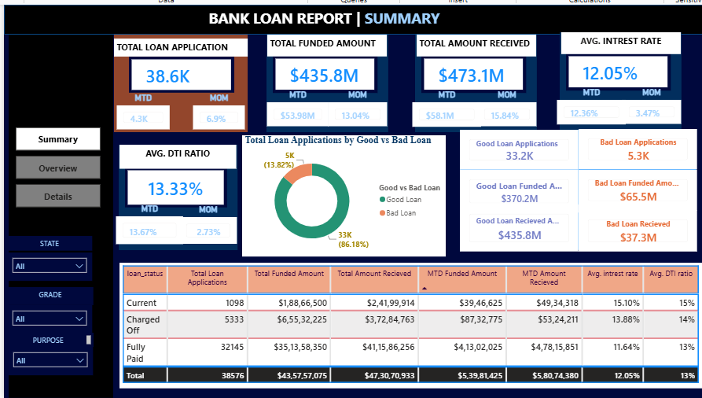
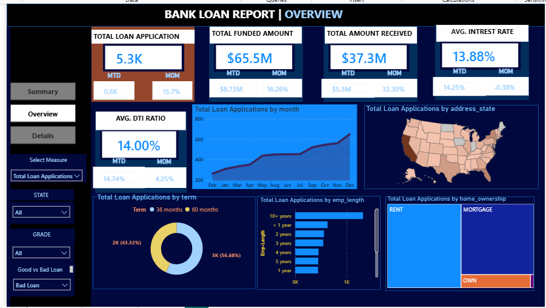
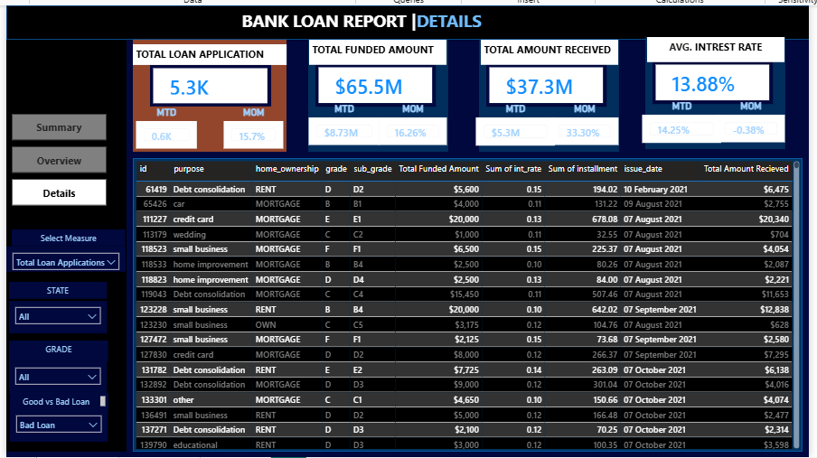

# Bank Loan Performance & Risk Analysis Dashboard

> **Transforming raw financial lending data into actionable risk management insights through optimized SQL queries and interactive Power BI visualizations.**

---

## 📌 Overview
This project provides an end-to-end analytics solution for bank lending data. By processing raw financial records through SQL and modeling them in Power BI, this repository demonstrates how to track key performance indicators (KPIs), evaluate portfolio health, monitor loan profitability, and assess risk distributions.

---

## 🎯 The Challenge
Financial institutions require clear visibility into their lending portfolios to mitigate default risk and optimize capital deployment. The goal of this analysis was to aggregate high-volume loan application trends, monitor funded amounts, and evaluate borrower creditworthiness to support data-driven lending and risk strategy decisions.

---

## 💡 The Solution
A robust analytical pipeline was built using SQL for data extraction, aggregation, and business logic implementation, followed by Power BI for dynamic modeling and visualization.

### Key Insights & Metrics Extracted
* **Overall Portfolio Health:** Analyzed 38,576 total loan applications representing over **$435 million** in total funded capital.
* **Risk Classification:** Categorized portfolio performance into **Good Loans (86.18%)** vs. **Bad Loans (13.82%)**, measuring total cash received against principal funded for each tier.
* **Borrower Profiles:** Evaluated portfolio health across a **12.05% average interest rate** and a **13.33% average Debt-to-Income (DTI)** ratio.
* **Dynamic Segmentation:** Granularly sliced performance across Month-to-Date (MTD), State, Loan Term, Employment Duration, Loan Purpose, and Homeownership status.

---

## 🛠️ Tools & Technologies Used
* **SQL:** Data querying, CTEs, window functions, and KPI calculation logic (MTD, Previous Month MTD).
* **Power BI:** Star schema data modeling (`bank_loan_dashboard.pbix`), DAX measures, interactive filtering, and dynamic visualization.
* **Excel / CSV:** Source data validation and preliminary analysis.

---

## 📊 Dashboard Preview
## 📊 Dashboard Preview

*Figure 1: High-Level Portfolio Performance & Summary View.*

 

*Figure 2: Monthly Trends & Key Metric Overview.*

 

*Figure 3: Granular Borrower & Loan Details Breakdown.*

---

## 👨‍💼 About Me
I am a **Senior Data Analyst** with 4+ years of experience analyzing large-scale datasets (100M+ records) across sales, marketing, and financial markets. My expertise spans **SQL, Power BI, Databricks, Python, and cloud environments (AWS/Azure)** to build scalable ETL pipelines, design high-performing data models, and deliver business-critical analytics.

Previously, I’ve optimized reporting infrastructure, redesigned data architectures to cut dashboard load times by 45%, and developed backtested strategies that generated $650K+ in ARR. I specialize in turning complex, multi-million-record datasets into actionable risk management insights, dynamic dashboards, and clear strategic roadmaps.

📫 **Connect with me:** [LinkedIn](https://linkedin.com/in/abdul-wahab-jhare) | **Email:** jhareabdul@gmail.com
